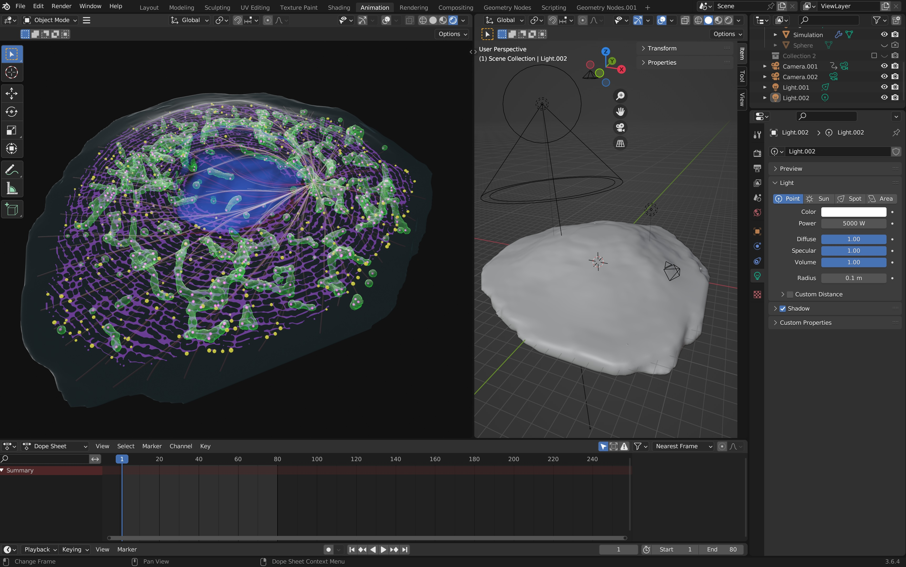

# Organelle Simulations in Blender Geometry Nodes
A repository of Blender files containing simulations of organelle dynamics within cells. 

### Simulating a mitochondrial network of a yeasrt cell:

### Scaling this up we get a mitochondrial network of a mammalian cell:

### Then we make it more complicated with interactions with a simulated ER network:

https://github.com/user-attachments/assets/121b8365-322e-4c19-9e83-564c85f15801

### And even make them crawl along the microtubules...

https://github.com/user-attachments/assets/812cf287-5ca5-4d77-9d24-c9f7d86af911

### Or.. we could add some more structures like cristae and nucleoids...

https://github.com/user-attachments/assets/7c9ed244-746d-47fc-ac11-f5cd1309c6b7

### Or... visualize the structures with 'fluorophores'...

https://github.com/user-attachments/assets/9439bc9f-53c6-4c96-8383-02da25a039bb

### Then we can make the mitochondrial undergo a **"pearling"** event!...

https://github.com/user-attachments/assets/92314d61-78e8-4447-bde0-7b4d09c8c187

### And even regulate the pearling event by the **cristae organization**...

https://github.com/user-attachments/assets/2e86c379-cc9d-482b-a199-aec578ab9401

### Bringing it all together... **MitoMadness!** a short film made in Blender:

To access Blender files use [Blender 3.6.4 LTS](https://www.blender.org/download/lts/3-6/)
