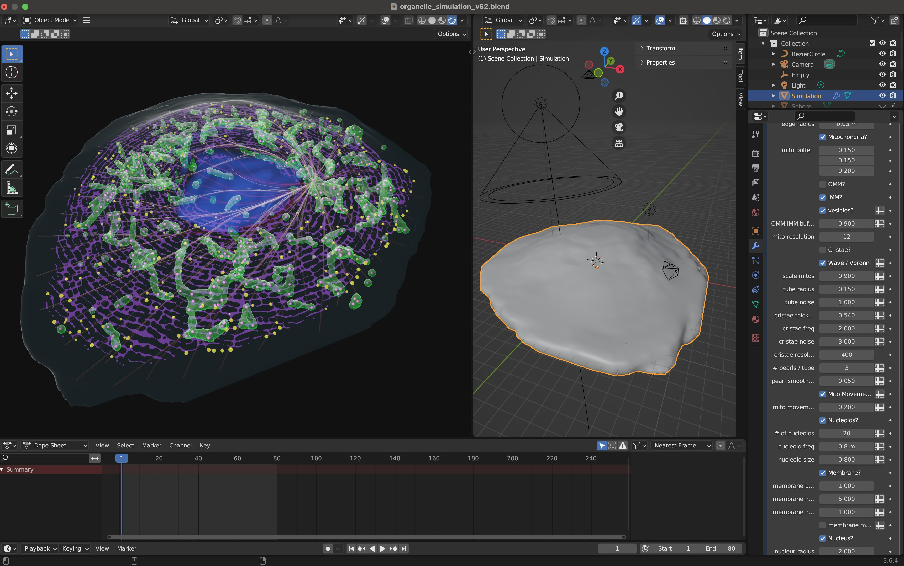

# Organelle Simulations in Blender Geometry Nodes
A repository of Blender files containing simulations of organelle dynamics within cells. 

Check out the simulation in action:

https://github.com/gav-sturm/Mitochondria_Simulations_Blender_GeoNodes/blob/main/videos/ER_mito_interactions.mp4

[MitoMadness](https://youtu.be/Khk7N2SxD_Q)

To access Blender files use 